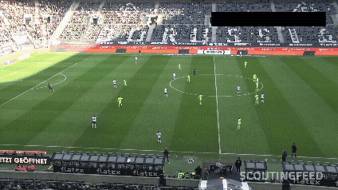
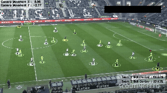

# Football Computer Vision Analysis

A real-time football match analysis system that detects and tracks players, referees, and the ball using deep learning and classical computer vision techniques. The pipeline assigns players to teams by jersey color, estimates ball possession, compensates for camera movement, and maps player positions to real-world pitch coordinates.

---

## Before / After

**Input — raw match footage**



**Output — fully annotated video**



> Each player is color-coded by team, assigned a tracking ID, and ball possession stats are displayed in real time.

---

## Features

- Player, referee, goalkeeper, and ball detection using a fine-tuned YOLOv5 model
- Persistent multi-object tracking with unique IDs across frames (ByteTrack)
- Automatic team assignment by jersey color using K-Means clustering
- Ball possession tracking per team (displayed as a percentage overlay)
- Camera movement estimation and compensation using Lucas-Kanade Optical Flow
- Real-world pitch coordinate mapping via perspective transformation
- Ball position interpolation to fill frames where the ball is not detected

---

## Pipeline

```
Raw Video
    │
    ▼
YOLOv5 Detection  ──►  ByteTrack (persistent IDs)
    │
    ├──► K-Means Clustering       → Team assignment by jersey color
    ├──► Lucas-Kanade Optical Flow → Camera movement compensation
    ├──► Perspective Transform     → Real-world pitch coordinates (68m × 23.32m)
    ├──► Ball Interpolation        → Fill missing ball positions
    └──► Euclidean Distance        → Ball possession per player / team
    │
    ▼
Annotated Output Video
```

---

## Technologies

| Category | Tool |
|---|---|
| Object Detection | YOLOv5 (fine-tuned on custom football dataset) |
| Multi-Object Tracking | ByteTrack (via `supervision`) |
| Team Assignment | K-Means Clustering (`scikit-learn`) |
| Camera Movement | Lucas-Kanade Optical Flow (`OpenCV`) |
| Coordinate Mapping | Perspective Transform (`OpenCV`) |
| Data Processing | NumPy, Pandas |
| Dataset | Roboflow — football-players-detection |

---

## Project Structure

```
├── main.py                          # Entry point — full pipeline
├── trackers/
│   └── tracker.py                   # YOLO detection + ByteTrack
├── team_assigner/
│   └── team_assigner_func.py        # K-Means jersey color clustering
├── player_ball_assigner/
│   └── player_ball_assigner.py      # Ball possession by proximity
├── camera_movement_estimator/
│   └── camera_movement_estimator.py # Optical flow camera compensation
├── view_transformer/
│   └── view_transformer.py          # Perspective to pitch coordinates
├── speed_and_distance_estimator/
│   └── speed_and_distance_estimator.py
├── utils/
│   ├── video_utils.py               # Read / write video
│   └── bbox_utils.py                # Bounding box helpers
├── development_and_analysis/
│   └── color_assignement.ipynb      # Exploratory analysis for team colors
├── models/                          # Model weights (not tracked)
├── data/                            # Input video (not tracked)
├── output_videos/                   # Annotated output
└── fragments/                       # Cached inference results (not tracked)
```

---

## Installation

```bash
git clone https://github.com/waelD1/Computer-vision-project.git
cd Computer-vision-project
pip install ultralytics supervision opencv-python scikit-learn numpy pandas python-dotenv
```

Place your model weights in `models/best.pt` and your input video in `data/08fd33_4.mp4`.

---

## Usage

```bash
python main.py
```

The annotated video will be saved to `output_videos/output_video.mp4`.

> **Note:** On the first run, detection and camera movement results are cached as `.pkl` files in `fragments/` to speed up subsequent runs.
